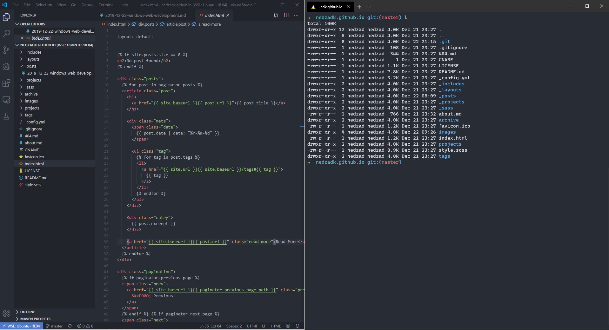
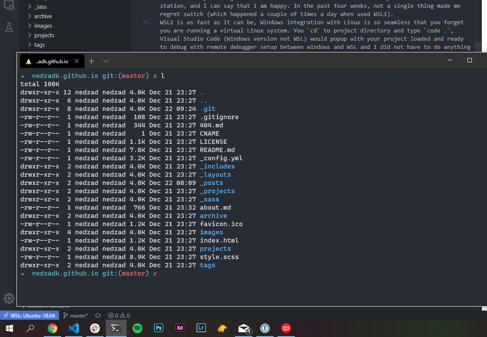

For more than seven years I've been using macOS and MacBooks exclusively for work and everything else. My tech stack mostly involves Javascript (React, Node, Angular) but I do have a couple of projects that are written using Ruby on Rails, Python and one even in Java (spring-boot).

I am a big fan of Macbooks and Apple because of their "it just works" philosophy, but I also think that hardware price is too much expensive and for the same price you can get a much better laptop elsewhere (except touch bar, no touch bar can match one on MacBook in PC land).
Windows is OS I grew up with like most of the kids in that time, it's a place where I made my first steps into the programming. 
I started with version 3.11 and as my first programming language, i picked Basic (again like most of the kids from that age), started with Basic for DOS and then I moved to Liberty Basic (funny thing, it is still around :D http://libertybasic.com/). 
So it was logical that I always had some nostalgic feel about Microsoft and Windows and was always looking for a reason to switch. 

Some of you might wonder why not Linux? It can run on most of the cheaper hardware and work pretty well. Well, I tried Linux (more than once) and although most development stuff I need is working perfectly on it, modern hardware support, software support (no, GIMP is no alternative to Photoshop and it probably never will be) and UX experience is what I think at least ten years behind Windows or macOS. Battery drains and bad handling of multiple GPUs inside laptops is still a common issue for all distros out there and I did try most of them. Closest one with most of the hardware related stuff working out of the box is Pop_OS! But on my new laptop, it refused to boot into installation without some fiddling with grub/gdisk. 

So I waited for Microsoft to wake up and start fighting for developers out there, and they kind of did, they gave us...

## WSL

In 2016 Microsoft announced a WSL (Windows Linux Subsystem) worthy alternative to Unix Roots of MacOS. WSL was Linux "compatibility layer" that allowed Windows to run Linux applications.

It sounded so cool but in reality, it was/is bad, you could not run every Linux application, it was painfully slow with I/O operations, installing the npm packages process could take minutes when in reality should have been done in seconds. 

On top of all those issues, no good terminal emulator was available, the best one that I've used with WSL was ConEmu or starting X Server and using Linux Terminator. 

Here and there I would give WSL a chance to impress me over the years, but it always failed to do so, and after a while, I stopped trying and went back to macOS always looking back to OS that made it all happen for me.

## New Hope (WSL2 or what WSL should have been)

But all was not lost, early in 2019 Microsoft introduced WSL2 with real Linux kernel this time and promised that it will solve all issues that WSL had. WSL2 runs as a lightweight virtual machine that is super fast that you sometimes might confuse it with real hardware (at least is what I heard).

So I waited a couple of versions and decided to give Windows another try as my main development machine* with Windows Insider version and beta WSL2 not expecting much but boy I was so wrong. 

I am currently writing this from the Windows machine that I use as my main fulltime dev station, and I can say that I am happy. In the past four weeks, not a single thing made me regret switch (which happened a couple of times a day when used WSL1). 
WSL2 is as fast as it can be, Windows integration with Linux is so seamless that you forget you are running a virtual Linux system. You `cd` to project directory and type `code .`, Visual Studio Code (Windows version not WSL) would popup with your project loaded and ready to debug with remote debugger setup between windows and WSL and I did not have to do anything except installing VS Code for Windows, rest of the setup (remote debugger and other stuff) were installed automatically on first Visual Studio Code start. 



Latest Docker Edge version has WSL2 support also and it works perfectly when enabled (in Docker settings after installation). So far I used to run Postgres and MySql databases for development inside WSL and it worked perfectly. 

I should also mention that together with WSL2 Microsoft introduced Windows Terminal a new and up to date terminal that can be used with Powershell, CMD, and WSL Linux installations. It supports all fancy features you might need except splitting view horizontally/vertically (I miss this, but a little bit of tmux solves this issue). 

## Conclusion 

So as I said after four weeks I am pretty happy with setup*, not a single issue appeared and my dev workflow is uninterrupted without hiccups.  

I am really happy to see where "new" Microsoft is going and excited for 2020 once WSL2 is released to the public. I am sure by then it will be a perfect tool for developers out there waiting for a proper alternative for their MacOS and MacBook. 


``` * Dell XPS 7390/13/FHD/16/512/i7 10510U  ```